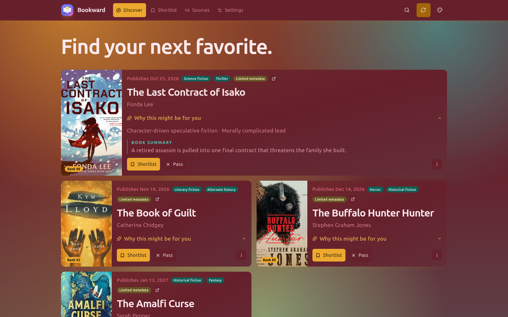
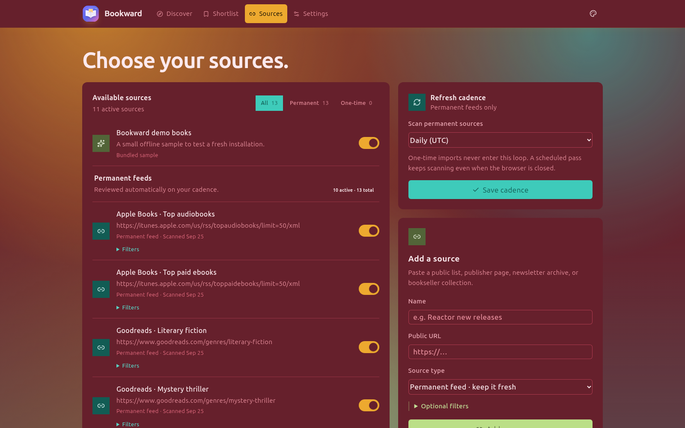
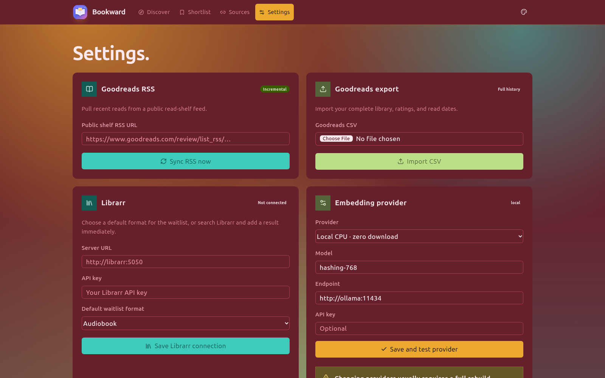
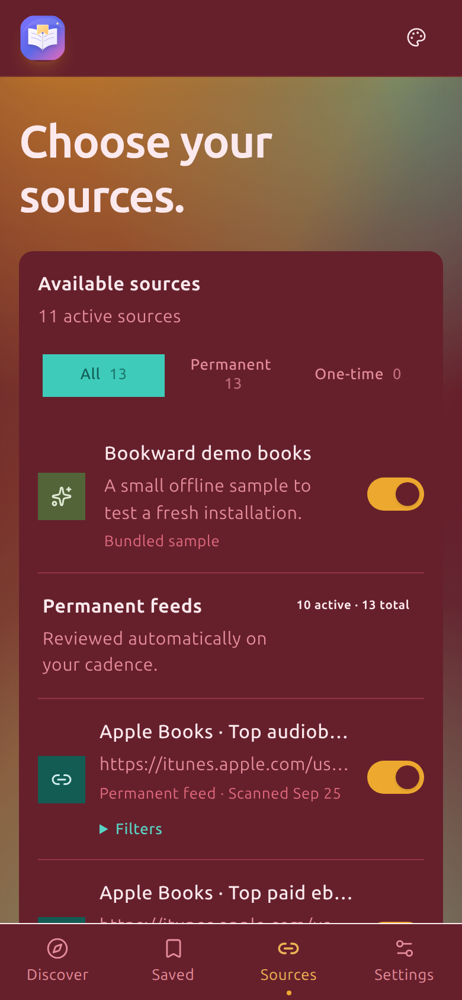
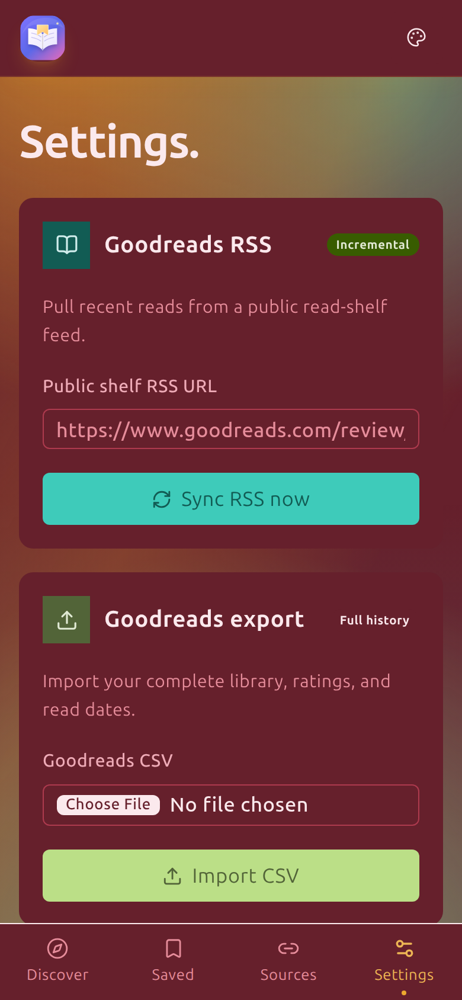

# Bookward

### A private, explainable way to find your next great read.

Bookward turns your reading history and the book lists you trust into a calm, personal shortlist. It runs on your own machine, shows why a recommendation appeared, and lets you send only the books you approve to Librarr.

It is for readers who want recommendations that feel personal without handing their entire library to another black-box service.

## See it in action

These screenshots use Bookward's bundled, sanitized demo catalog and default connection settings. A fresh install includes a small sample so you can explore before connecting your own library. The captures use dark mode with the Sahara theme. Desktop images are 1600 × 1000; mobile images use a 390 × 844 CSS pixel viewport and are saved at 2× resolution.

### Desktop

### Mobile

<table>
  <thead>
    <tr><th scope="col">Discover</th><th scope="col">Sources</th><th scope="col">Settings</th></tr>
  </thead>
  <tbody>
    <tr>
      <td></td>
      <td></td>
      <td></td>
    </tr>
  </tbody>
</table>

Choose the feeds that shape your recommendations. A permanent source can refresh on a schedule; a one-time import stays in your discovery pool without being polled again. Settings is where you import reading history, choose an embedding provider, connect Librarr, and optionally configure a weekly digest.

## Why Bookward?

- **Your data stays with you.** Bookward is self-hosted, uses SQLite, and does not ask for Goodreads credentials. The default Docker binding is localhost.
- **Recommendations are explainable.** Each book includes a match score, source, and plain-language reasons instead of an unexplained ranking.
- **You control the inputs.** Import your Goodreads history, keep or disable the bundled upcoming-book sample, and add public lists from publishers, booksellers, newsletters, or other trusted sources.
- **Discovery can become a reading habit.** Shortlist books, pin a few as Up next, track what you are Reading, and mark books Finished with an optional rating. You can also add a title to a Librarr ebook or audiobook waitlist.
- **Automation is optional and gentle.** Scheduled source refreshes and weekly Discord or email digests are off until you choose them. Delivery is recorded and retryable.
- **It is comfortable to use.** The responsive interface includes keyboard-friendly controls, a skip-to-content link, accessible labels, light/dark/system modes, and reduced-motion support.

## Features

### For readers

- Import a complete Goodreads CSV export, including ratings and read dates.
- Refresh recent Goodreads reads through a public read-shelf RSS feed.
- Combine reading history with author, subject, and text-similarity signals.
- Review recommendations in Discover, then shortlist, pass, or restore them. Move saved books through Saved, Reading, and Finished, with an optional rating when you finish.
- Pin a saved book as Up next to keep it at the front of your shortlist.
- Search Librarr from a recommendation and add a matching ebook or audiobook directly.
- Choose the visual theme and appearance mode that work best for you.

### For curious tinkerers

- Start with a zero-download local hashing embedder that works on CPU-only machines.
- Switch to FastEmbed, Ollama, or an OpenAI-compatible remote embedding endpoint when you want to experiment.
- Add permanent feeds or one-time imports from public, HTTPS-accessible pages.
- Set source refresh cadence to manual-only, every 6 hours, daily, or weekly.
- Send weekly digests to Discord, SMTP email, or both, with minimum-score and “only new books” controls.

### For self-hosters

- SvelteKit frontend and FastAPI engine run independently, with no external scheduler required.
- SQLite stores the catalog, feedback, jobs, settings, and delivery history in one persistent volume.
- Integration keys are encrypted in the engine database and are never returned to the browser.
- Public source fetching rejects private, loopback, link-local, and metadata addresses.
- Docker images are built in CI and published to GitHub Container Registry from version tags.

## API

Bookward exposes a versioned API for automations and other applications. Open Settings → API access, name a token, and select **Generate token**. The full token is displayed only once; store it in the calling application and revoke it from the same screen if it is no longer needed.

When upgrading an existing install, restart the engine once so pending SQLite migrations are applied. Existing saved and Librarr-imported books remain on your shortlist and start in the Saved shelf.

The public base URL is:

~~~
https://your-bookward-host.example/api/v1
~~~

Send the token with every request:

~~~bash
curl https://your-bookward-host.example/api/v1/recommendations \
  -H 'Authorization: Bearer bkw_…'
~~~

The v1 API supports recommendations and feedback, source listing and management, Goodreads RSS imports, sync and scoring jobs, job status, and the Librarr search/download integration. The most commonly used routes are:

- `GET /api/v1/overview` — recommendations, reading history, sources, and safe settings.
- `GET /api/v1/recommendations` — filter with `status=recommended|saved|imported|all`, cap with `limit`, and page with `offset`.
- `POST /api/v1/recommendations/{id}/feedback` — send `{"action":"save"}`, `reject`, or `restore`.
- `GET /api/v1/reading-list` — list shortlisted books with their `reading_status`, `up_next`, rating, and timestamps.
- `PUT /api/v1/reading-list/{id}` — set `{"status":"reading"}`, `{"status":"finished","rating":5}`, `{"status":"saved"}`, or `{"up_next":true}`.
- `GET /api/v1/sources` — list configured sources.
- `POST /api/v1/sync` — queue a source refresh and return a job ID.
- `GET /api/v1/jobs/{id}` — check a background job.

The engine also publishes the complete interactive OpenAPI schema at `/openapi.json` and Swagger UI at `/docs` when it is run directly. The web application proxy keeps `/api/v1` available at the public Bookward URL.

Keep the engine port private; the versioned web proxy is the intended external API boundary. API tokens currently grant the full v1 API and do not expire, so revoke them promptly if they are compromised.

## How recommendations work

Bookward ranks books that it can find through your enabled sources; it does not invent titles or search every book in print. The ranking process is:

1. **Build a candidate pool.** The bundled demo list, public feeds, and one-time imports provide books to consider. Goodreads CSV and RSS imports describe what you have read and how you rated it.
2. **Fill in available details.** The engine checks catalog sources for descriptions, subjects, publication dates, and covers. It removes books it recognizes as already read or already shortlisted from the recommendation feed.
3. **Compare book text.** The engine turns each book's title, author, description, and available subjects into a numeric representation called an *embedding*. For the default local provider, similar representations mainly reflect shared words and two-word phrases. Optional model-based providers can also match related wording. These representations are cached and refreshed when the source text changes.
4. **Rank likely matches.** Books that resemble highly rated reads move up; close matches to low-rated books move down. Ratings for the same author, reading dates, and the weight of a source also contribute. The engine gives less weight to a candidate when its catalog details are sparse.
5. **Learn from clear choices.** Shortlisting or passing on a book, and some reads linked back to a recommendation, can refine later rankings when there is enough consistent evidence. Simply seeing a book or opening its details is not counted as a dislike.
6. **Show the strongest reasons.** Each card can point to a similar rated book, an author pattern, its source, or missing catalog details. These notes summarize useful evidence; they are not a line-by-line account of every scoring factor.

The displayed score is a 0–100 ranking signal, not a percentage chance that you will enjoy the book. It helps order the current candidate pool.

### Limitations

- **The source list sets the boundaries.** A book outside your enabled feeds and imports is not available to rank. Incomplete or quiet sources can make the pool small or repetitive.
- **Book details can be sparse or wrong.** Public catalogs do not always have reliable summaries, subjects, dates, or edition matches. Sparse details reduce the influence of text similarity, but the engine cannot fill in information that is missing.
- **Reading history only tells part of the story.** Ratings and titles do not explain why you liked a book, what mood you were in, or what you want to read next. The default local text matcher is simple; richer embedding models still depend on accurate book text.
- **Personalization needs feedback.** A small number of ratings or shortlist/pass actions may not reveal a stable preference. An unseen or unrated book is not treated as a negative signal.
- **The score is a heuristic.** Scores are designed to rank the available books, not to promise enjoyment or make an objective quality judgment. Explanations can also be brief when there is little evidence.

The default hashing provider runs on the Bookward engine host. If you choose a remote embedding endpoint, the book text used to create embeddings is sent to that endpoint for processing.

## How the app fits together

~~~
Goodreads CSV / RSS + trusted public lists
                    |
                    v
          FastAPI engine + SQLite
          import -> enrich -> score
                    |
                    v
              SvelteKit UI
       explain -> shortlist -> decide
                    |
          +---------+----------+
          |                    |
       Librarr            Discord / SMTP
     (optional)           weekly digest
~~~

Bookward is deliberately split into a friendly web UI and an independent engine. The engine keeps working when the browser is closed: it owns source refreshes, scoring jobs, cover enrichment, digest scheduling, and the SQLite reading list. See [the reading workflow guide](docs/reading-workflow.md) for state transitions and API examples.

## Quick start for development

### Prerequisites

- Node.js 24 or newer
- Python 3.12 or newer
- [uv](https://docs.astral.sh/uv/) for the Python environment
- Docker and Docker Compose are optional for local development

### 1. Install dependencies

~~~
git clone https://github.com/sgerner/bookward.git
cd bookward

npm ci
uv sync --project engine --extra dev --frozen
~~~

If you do not use `uv`, create a virtual environment and install the engine package directly:

~~~
python3.12 -m venv engine/.venv
. engine/.venv/bin/activate
pip install -e engine
~~~

### 2. Start the recommendation engine

From the repository root, in one terminal:

~~~
AFTERWORD_DB=./data/afterword.db \
  uv run --project engine uvicorn afterword_engine.main:app \
  --reload --host 127.0.0.1 --port 8000
~~~

The `AFTERWORD_` environment prefix and `afterword_engine` Python package are retained for compatibility with the project's earlier name.

### 3. Start the web app

In a second terminal:

~~~
ENGINE_URL=http://127.0.0.1:8000 \
  npm run dev -- --host 127.0.0.1 --port 5173
~~~

Open <http://127.0.0.1:5173>. The engine creates the SQLite database and a clearly labeled, sanitized demo catalog on a fresh install. Those books are sample data, not a live editorial feed; disable the demo source from **Sources** when you are ready to use your own inputs.

### 4. Make it yours

1. Open **Settings** and import a full Goodreads CSV export. RSS is useful for incremental refreshes, but a CSV export is the way to bring in your complete history.
2. Open **Sources** and keep only the public lists you trust. Add your own permanent feeds or one-time imports when you find a good list.
3. Review the explanation on each recommendation, then shortlist the books you want to keep.
4. Optionally connect Librarr under **Settings** and choose ebook or audiobook as the default waitlist format.
5. If you want a nudge, configure a weekly Discord or email digest. Use the per-channel test buttons before enabling it.

## Run with Docker

Docker is the easiest way to run Bookward as a small self-hosted service.

~~~
cp .env.example .env
~~~

Before exposing Bookward beyond your own machine, set a strong `AFTERWORD_AUTH_PASSWORD` and set `ORIGIN` and `AFTERWORD_PUBLIC_URL` to the exact URL readers will open. The default `BIND_ADDRESS=127.0.0.1` keeps the service local.

~~~
docker compose up --build -d
~~~

Open <http://127.0.0.1:3000>. Bookward stores SQLite data and the generated encryption key in the `afterword-data` volume. Stop the stack with:

~~~
docker compose down
~~~

The default `local` embedding backend needs no model download and works on CPU-only machines. Optional alternatives include FastEmbed, an Ollama model, or an OpenAI-compatible endpoint. To try Ollama locally:

~~~
docker compose --profile ollama up --build -d
docker compose exec ollama ollama pull qwen3-embedding:0.6b
~~~

For NVIDIA acceleration, install the NVIDIA Container Toolkit and add the GPU Compose override:

~~~
docker compose -f compose.yaml -f compose.gpu.yaml \
  --profile ollama up --build -d
~~~

If Librarr runs in another container, put both services on the same Docker network, allow its hostname through `LIBRARR_ALLOWED_HOSTS`, and use its internal URL (usually `http://librarr:5050`) in **Settings**.

## Configuration at a glance

Copy `.env.example` to `.env` for Docker, or export variables in the shell for a local run.

| Variable | Purpose |
| --- | --- |
| `ORIGIN` | Canonical browser origin used by the web server. |
| `AFTERWORD_PUBLIC_URL` | Base URL included in Discord and email digest links. |
| `BIND_ADDRESS` | Host interface for the Docker web port; keep `127.0.0.1` unless you have a secured deployment. |
| `AFTERWORD_AUTH_USERNAME` / `AFTERWORD_AUTH_PASSWORD` | Optional HTTP Basic authentication for the web app. |
| `AFTERWORD_DB` | SQLite path for a local engine run. Docker uses `/data/afterword.db`. |
| `EMBEDDING_BACKEND` / `EMBEDDING_MODEL` | Provider and model selected by the engine. |
| `EMBEDDING_URL` / `EMBEDDING_API_KEY` | Endpoint and optional key for remote or Ollama providers. |
| `SOURCE_SYNC_INTERVAL_HOURS` | First-install default for permanent-source polling; the UI can change it later. |
| `AFTERWORD_SECRET_KEY` | Optional Fernet key; if omitted, Docker generates one in its data volume. |
| `LIBRARR_ALLOWED_HOSTS` | Comma-separated private hostnames allowed to receive the Librarr API key. |

The engine also persists source cadence and application settings in SQLite, so changes made in the UI survive restarts.

## Testing and quality checks

Run the same checks used by CI before opening a pull request:

~~~
# Frontend
npm run check
npm test
npm run build

# Engine
uv sync --project engine --extra dev --frozen
uv run --project engine pytest -q engine/tests
uv run --project engine python -m compileall -q engine/afterword_engine

# Container smoke build
docker compose build
~~~

The frontend suite covers Svelte/type checks and unit tests. The engine suite covers imports, source validation, scoring, jobs, Librarr idempotency, digest delivery, and secret handling. The GitHub Actions workflow also runs CodeQL, dependency review, and both Docker image builds on pull requests.

## Contributing

Bookward is easier to improve when changes are small, understandable, and easy to try. A good contribution can be a bug fix, a clearer explanation, an accessible UI improvement, a new source adapter, or a better developer workflow.

1. Open an issue for a larger behavior change, or start with a focused branch from `main`:

   ~~~
   git switch -c feat/describe-your-change
   ~~~

2. Make the smallest change that solves the problem. Keep product copy friendly and direct.
3. Run the relevant checks from [Testing and quality checks](#testing-and-quality-checks).
4. For UI changes, include before/after screenshots in the pull request and check the layout at narrow and wide widths.
5. Keep controls keyboard reachable, provide labels for new inputs, preserve visible focus, and respect `prefers-reduced-motion`.
6. Open a pull request against `main` with a short summary, testing notes, and any setup or migration detail a reviewer needs.

Please do not commit `.env` files, database files, API keys, webhook URLs, SMTP credentials, or generated secret keys. Use the sanitized demo catalog or redacted fixtures when adding examples. See [SECURITY.md](SECURITY.md) for vulnerability reports.

## Project map

~~~
src/                         SvelteKit UI, form actions, and browser theme handling
engine/                      FastAPI ingestion, jobs, scoring, SQLite, and integrations
engine/tests/                Python engine tests
src/**/*.spec.ts             Frontend and server unit tests
static/                      Favicon, manifest, and static web assets
docs/screenshots/            README screenshots from the sanitized demo
compose.yaml                 Local Docker stack
compose.gpu.yaml             Optional NVIDIA/Ollama override
.github/workflows/            CI, CodeQL, dependency review, and image publishing
~~~

## Troubleshooting

### The web app shows a 503 page

The UI intentionally shows a retryable 503 page when the engine is unavailable. Start the engine first and confirm that `ENGINE_URL` points to the same host and port as uvicorn.

### The first run looks too quiet

The default local embedder is intentionally small and predictable. FastEmbed, Ollama, and remote providers may download a model or take longer during their first indexing pass. Check **Settings** and the engine terminal for progress.

### Goodreads import is incomplete

Use the full Goodreads CSV export for historical data. The RSS feed is designed for incremental refreshes of recent reads, not for reconstructing an entire library.

### Librarr works in Docker but not locally (or vice versa)

The URL must be reachable from the engine process, not just from your browser. Use `http://librarr:5050` between containers and `http://127.0.0.1:5050` when both services run on the host.

## Automation and releases

Every push to `main` and every pull request runs frontend checks, engine tests, Python compilation, CodeQL analysis, dependency review, and both Docker builds. Dependabot checks npm, Python, and GitHub Actions dependencies weekly.

Pushing a tag matching `v*.*.*` publishes the Bookward and engine images to GitHub Container Registry as the version tag and `latest`.
